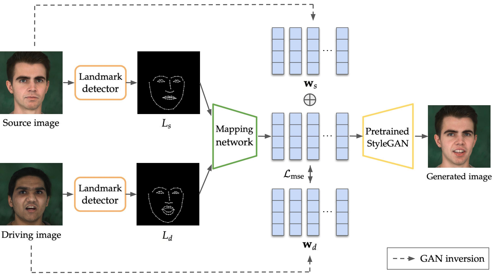
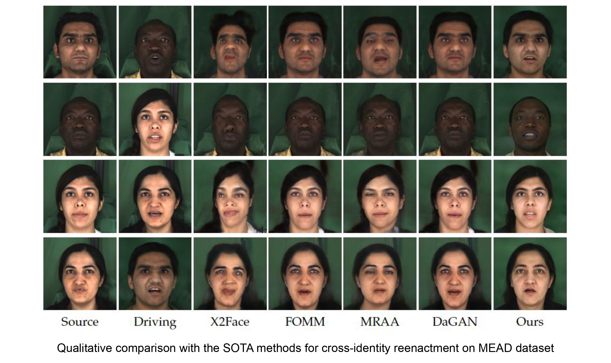

# One-Shot Landmark-Based Face Reenactment
This repository contains the source code for my master's thesis, One-Shot Landmark-Based
Face reenactment.

<p align="center"></p>

## Introduction
In this thesis, we propose a One-Shot Landmark-Based Face Reenactment, which generates 
reenacted images given a single source identity image conditioned by the facial landmarks 
of the driving video. Our method generates high-resolution reenacted video by incorporating 
a pretrained Style-Based Generative Adversarial Network (StyleGAN) generator. We first 
embed the source identity and driving image in the StyleGAN latent space via optimization. 
We then train the mapping network, which learns to map the displacement in the facial
landmarks of the source and driving image to the displacement in the StyleGAN latent
vectors of the source and driving image. We evaluate our model on standard measures
and show that our method gives a comparable performance to the recent state-of-the-
art methods on the human face dataset.

## Setup
Create conda environment with packages to be installed.
```shell
conda env create -f stylegan.yml
```

## Usage
For the implementation details, please have a look at the thesis paper `thesis.pdf`.
### Optimization
Before the optimization, extract all frames from your training data videos and align the
faces in the frames using face alignment (see [here](https://github.com/1adrianb/face-alignment)).
Then, put all frames into DATASET_PATH directory. To use ArcFace identity loss, download the 
pretrained model from [here](https://onedrive.live.com/?cid=cec0e1f8f0542a13&id=CEC0E1F8F0542A13%21835&authkey=%21AOw5TZL8cWlj10I) 
and run the below command to optimize the latent vectors in StyleGAN space:
```shell
mkdir opt_MEAD
python optimize.py --img_dir=DATASET_PATH
```
Then, the optimized images will be saved in the directory `opt_MEAD` and the list of the 
optimized latent vectors will be saved as `latents_MEAD.pkl`. 

### Training
Before training the mapping network, prepare `latents_MEAD_ID.pkl` by extracting only
latent vectors of every actor's identity frames from `latents_MEAD.pkl`. For facial landmark 
detection, run [OpenPose](https://github.com/CMU-Perceptual-Computing-Lab/openpose) and save 
the landmark images in the directory `face_landmark` and `face_landmark_id`. Finally, to train 
the mapping network:
```shell
python train.py
```

### Evaluation
To evaluate the trained model, first prepare the test source identity latent vector 
(`latents_ID_test.pkl`) and the landmark images (`face_landmark_test` for driving actor and 
`face_landmark_id_test` for source actor) in the same way as the training dataset and run:
```shell
python test.py
```

<p align="center"></p>
